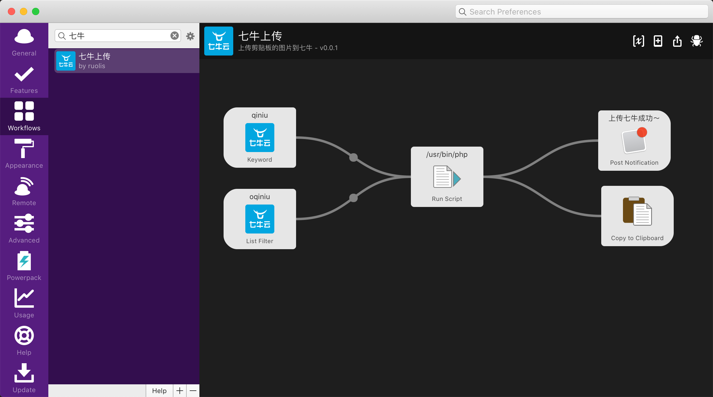
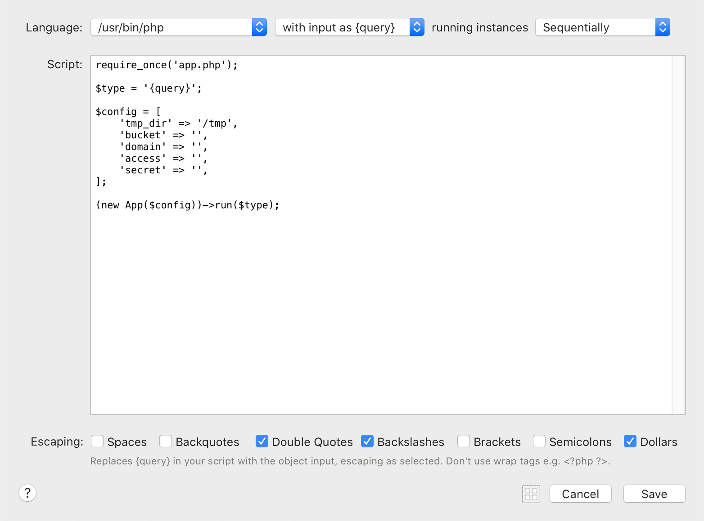

## 剪贴板图片上传至七牛

### 介绍

- 借助 **Alfred** 的 **Workflow** 实现截图到剪贴板之后，上传到七牛，并生成 **Markdown** 格式的图片链接；

- 同时也是支持先复制图片到剪贴板之后上传的；

### 特性

- 如果光标当前是在可编辑状态，则直接粘贴生成的图片链接到当前光标位置；
- 如果生成文件扩展名为 `png` 则使用 `pngquant` 进行压缩；

### 前置条件

- [Alfred](https://www.alfredapp.com/) && [Alfred Powerpack](https://www.alfredapp.com/powerpack/)
- PHP > 7.1
- [pngpaste](https://github.com/jcsalterego/pngpaste) 保存剪贴板内容到文件
- [pngquant](https://github.com/kornelski/pngquant) 压缩 png
- 七牛账号

### 安装

下载最新的 [release](https://github.com/ruolis/clipboard-image-to-qiniu/releases) 到本地，双击安装。

### 使用

1. 安装好之后，打开 **Alfred** 的设置，找到左侧的 **Workflows**，如下图所示，然后双击图片中间的 **Run Script** 部分；

2. 在弹出的界面中，输入自己申请的七牛账号相关的配置信息；

3. 配置好之后就可以愉快的使用了😄~

### 其他

也可以输入 `oqiniu` 选择想要生成的文件扩展名

